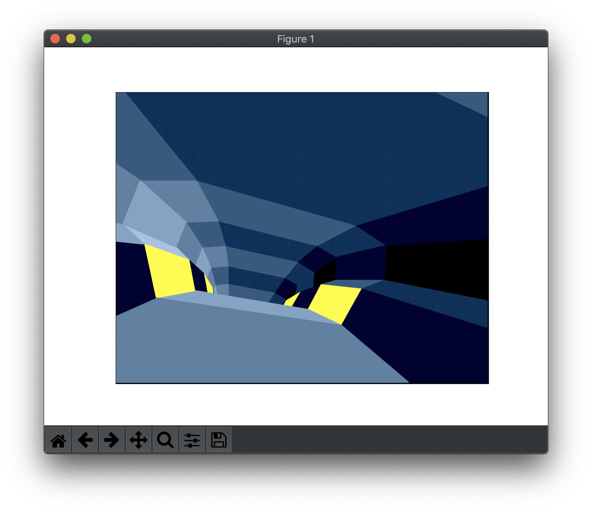

# niccc-matplotlib

A port of the classic _STNICCC2000 Demo_ by Oxygene ([YouTube](https://www.youtube.com/watch?v=8VOCbmMMteY), [Poüet](https://www.pouet.net/prod.php?which=1251)), written in Python 3 with matplotlib.

The `scene1.bin` polygon data stream is taken from http://arsantica-online.com/st-niccc-competition/

